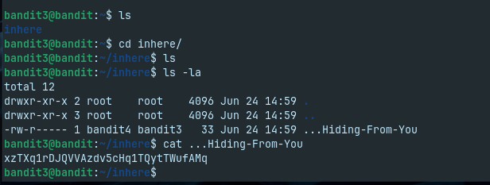
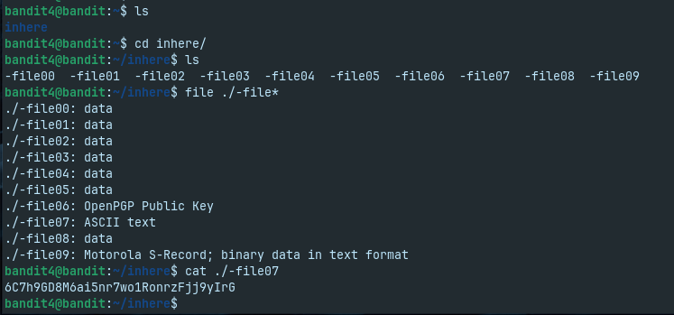
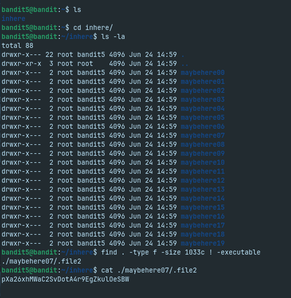
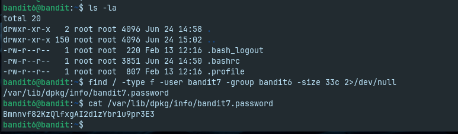
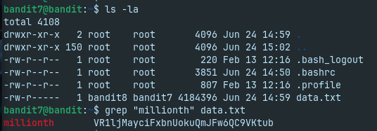
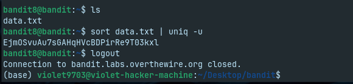
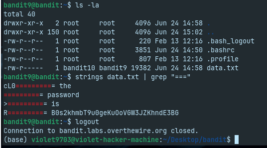
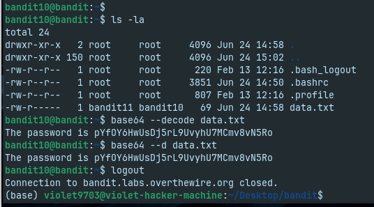

# Bandit Levels 0–10

**Platform:** OverTheWire – Bandit

**Focus Areas**
- SSH
- Linux filesystem navigation
- Hidden files
- Special filenames
- File metadata
- Searching files
- Text processing
- Base64 decoding

---

# Level 0

## Objective

Connect to the Bandit server using SSH and retrieve the contents of the introductory file.

## Commands

```bash
ssh bandit0@bandit.labs.overthewire.org -p 2220
ls
cat readme
```

## Takeaways

- Established a remote SSH session.
- Practiced basic file listing and file reading.

---

# Level 1

## Objective

Read the contents of a file whose name begins with a hyphen (`-`).

## Commands

```bash
cat ./-
```

## Takeaways

- Learned how to reference filenames that could otherwise be interpreted as command options.
- Practiced using relative paths to access special filenames.

---

# Level 2

## Objective

Read a file whose filename contains spaces.

## Commands

```bash
cat "./--spaces in this filename--"
```

## Takeaways

- Learned to quote filenames containing spaces.
- Reinforced shell path handling.

---

# Level 3

## Objective

Locate and read a hidden file inside a directory.

## Commands

```bash
cd inhere
ls -la
cat .hidden-file
```

## Takeaways

- Used `ls -la` to display hidden files.
- Understood how hidden files are represented in Linux.

## Screenshot



---

# Level 4

## Objective

Identify the only human-readable file within a directory.

## Commands

```bash
cd inhere
file ./-file*
cat ./-file07
```

## Takeaways

- Used the `file` command to determine file types.
- Distinguished text files from binary files.

## Screenshot



---

# Level 5

## Objective

Locate a file based on its metadata.

## Commands

```bash
find . -type f -size 1033c ! -executable
cat ./maybehere07/.file2
```

## Takeaways

- Used `find` with multiple filters.
- Practiced searching using file properties instead of filenames.

## Screenshot



---

# Level 6

## Objective

Search the filesystem for a file matching specific ownership and size requirements.

## Commands

```bash
find / -type f -user bandit7 -group bandit6 -size 33c 2>/dev/null
```

## Takeaways

- Used ownership and permissions as search criteria.
- Suppressed permission errors using standard error redirection.

## Screenshot



---

# Level 7

## Objective

Locate specific information inside a large text file.

## Commands

```bash
grep "millionth" data.txt
```

## Takeaways

- Learned to search file contents using `grep`.
- Reinforced basic text-processing workflows.

## Screenshot



---

# Level 8

## Objective

Identify the unique line within a text file.

## Commands

```bash
sort data.txt | uniq -u
```

## Takeaways

- Learned why `sort` is required before using `uniq`.
- Practiced identifying unique entries in datasets.

## Screenshot



---

# Level 9

## Objective

Extract human-readable strings from a mixed-content file to locate relevant information.

## Commands

```bash
strings data.txt | grep "^==="
```

## Takeaways

- Used `strings` to inspect printable content within a file.
- Combined text-processing tools using shell pipelines.

## Screenshot



---

# Level 10

## Objective

Decode Base64-encoded data.

## Commands

```bash
base64 --decode data.txt
```

## Takeaways

- Learned to decode Base64-encoded content.
- Understood the difference between encoding and encryption.

## Screenshot


