# Bandit Levels 11–15

**Platform:** OverTheWire – Bandit

This milestone focuses on data transformation, archive extraction, SSH authentication, and secure network communication using standard Linux utilities.

## Skills Practiced

- ROT13 decoding
- Character translation (`tr`)
- Hexdump reversal (`xxd`)
- File type identification
- Working with compressed archives
- Temporary workspace management
- SSH private key authentication
- Linux file permissions
- TCP communication (`nc`)
- TLS communication (`openssl s_client`)

---

# Level 11

## Objective

Decode text encoded with the ROT13 substitution cipher.

## Commands

```bash
cat data.txt | tr 'A-Za-z' 'N-ZA-Mn-za-m'
```

or

```bash
tr 'A-Za-z' 'N-ZA-Mn-za-m' < data.txt
```

## Skills Practiced

- Used `tr` to perform character translation.
- Decoded text encoded with the ROT13 cipher.
- Reinforced the difference between encoding and encryption.

## Screenshot

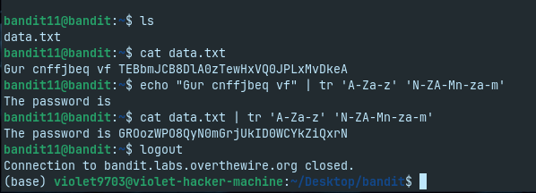

---

# Level 12

## Objective

Recover the original file from multiple layers of encoding and compression.

## Commands

```bash
mktemp -d

cd /tmp/<temporary-directory>

cp ~/data.txt .

xxd -r data.txt > data

file data

mv data data.gz
gunzip data.gz

file data

mv data data.bz2
bunzip2 data.bz2

file data

mv data data.tar
tar -xf data.tar

file data5.bin

mv data5.bin data5.tar
tar -xf data5.tar

file data6.bin

mv data6.bin data6.bz2
bunzip2 data6.bz2

file data6

mv data6 data6.tar
tar -xf data6.tar

file data8.bin

mv data8.bin data8.gz
gunzip data8.gz

cat data8
```

## Skills Practiced

- Used `mktemp` to create a temporary working directory.
- Reversed a hexadecimal dump using `xxd`.
- Identified file formats with `file`.
- Extracted multiple compressed archive formats.
- Worked safely without modifying the original file.

## Screenshots

### Initial File Analysis

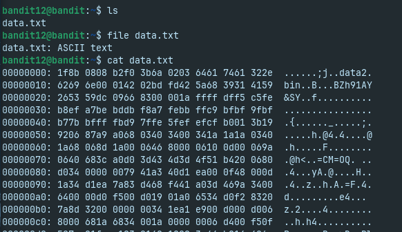

### Extraction Process

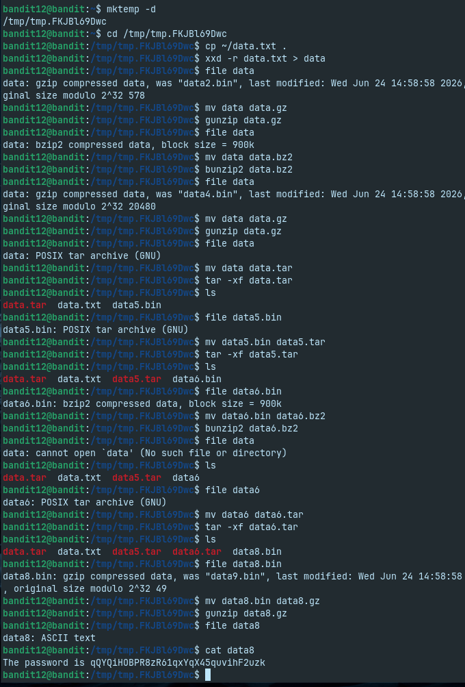

---

# Level 13

## Objective

Authenticate using an SSH private key to access the next level.

## Commands

```bash
ls

file sshkey.private

chmod 600 sshkey.private
```

```bash
ssh bandit.labs.overthewire.org -p 2220 \
-l bandit14 \
-i sshkey.private
```

## Skills Practiced

- Identified an OpenSSH private key.
- Learned that SSH private keys require restrictive (`600`) permissions.
- Authenticated using key-based SSH instead of a password.

## Screenshots

### Inspecting the Private Key

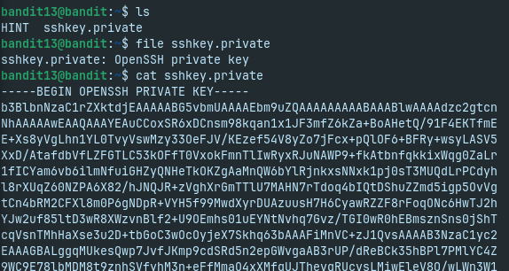

### Preparing the SSH Key

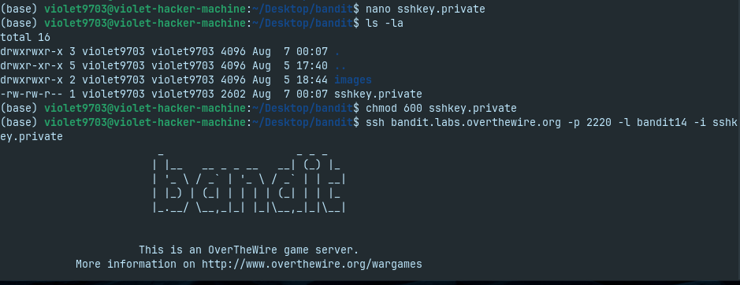

### SSH Authentication

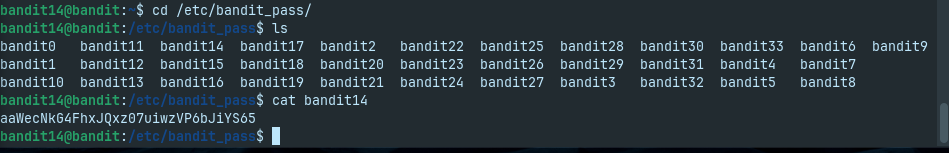

---

# Level 14

## Objective

Submit the current credential to a local TCP service to retrieve the next credential.

## Commands

```bash
nc localhost 30000
```

or

```bash
echo "<current-password>" | nc localhost 30000
```

## Skills Practiced

- Used Netcat to communicate with a local TCP service.
- Passed input directly through standard input.
- Practiced basic client-server communication.

## Screenshot

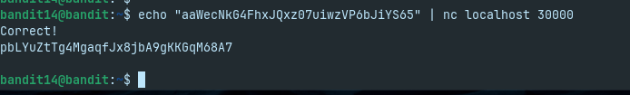

---

# Level 15

## Objective

Communicate with a local service over an encrypted TLS connection.

## Commands

```bash
openssl s_client -connect localhost:30001 -quiet
```

```bash
echo "<current-password>" | \
openssl s_client -connect localhost:30001 -quiet
```

## Skills Practiced

- Established a TLS connection using `openssl s_client`.
- Distinguished encrypted communication from plain TCP.
- Practiced interacting with secure network services.

## Screenshot

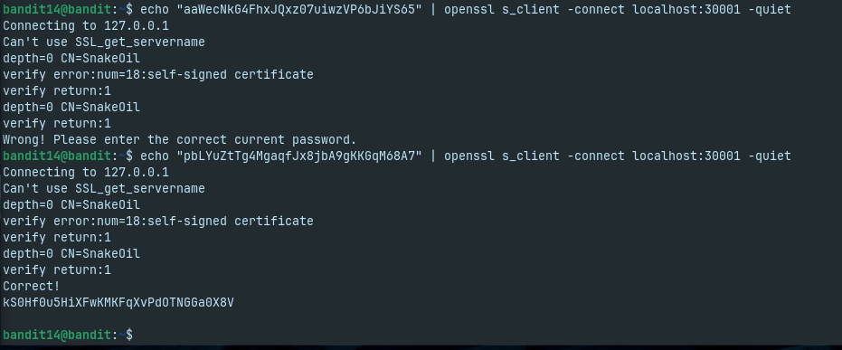

---

# Level 16

## Objective

Identify the correct SSL/TLS-enabled service within a range of local ports and use it to retrieve the credentials for the next level.

## Commands

### Scan for Open Ports

```bash
nmap -p 31000-32000 localhost
```

### Identify SSL/TLS Services

```bash
nmap -sV -p 31000-32000 localhost
```

### Connect to the Correct Service

```bash
openssl s_client -connect localhost:<port> -quiet
```

### Submit the Current Credential

```text
<current-password>
```

## Skills Practiced

- Scanned a range of TCP ports using Nmap.
- Identified running services and detected SSL/TLS support.
- Used `openssl s_client` to communicate with an encrypted service.
- Validated the correct service before interacting with it.

## Screenshots

### Port Scan

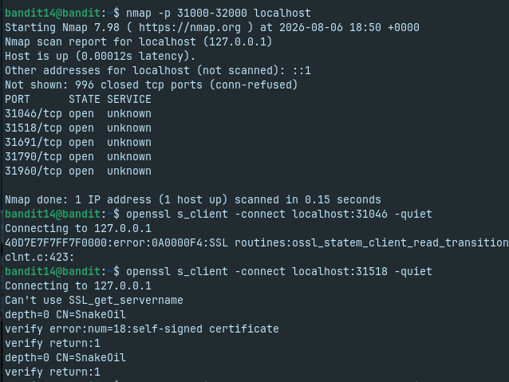

### Service Enumeration

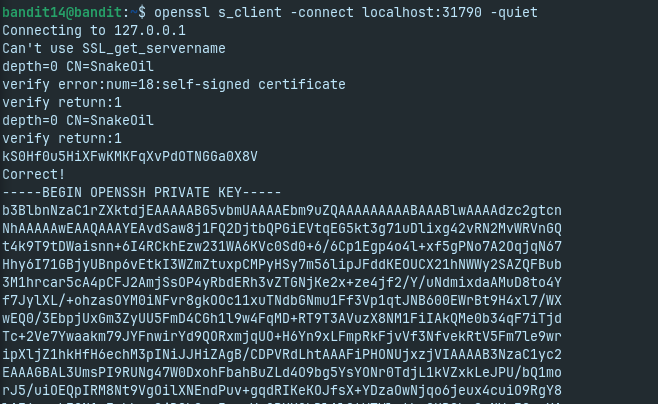

### TLS Connection

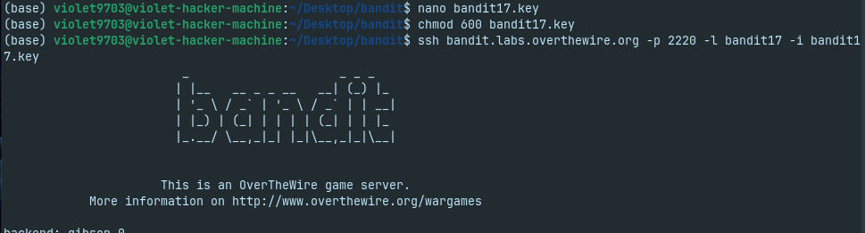

### Retrieved SSH Key

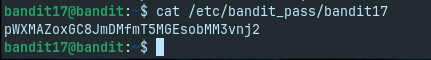

---

# Level 17

## Objective

Compare two files and identify the line that differs between them.

## Commands

```bash
diff passwords.old passwords.new
```

Alternative:

```bash
sdiff passwords.old passwords.new
```

## Skills Practiced

- Compared files using `diff`.
- Identified changes between two versions of a file.
- Learned a common technique used for configuration auditing and change tracking.

## Screenshot

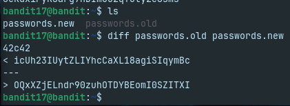

---

# Level 18

## Objective

Access the system despite the interactive shell terminating immediately after login and retrieve the required file.

## Commands

Execute a command directly during SSH login:

```bash
ssh bandit18@bandit.labs.overthewire.org -p 2220 "cat readme"
```

Alternative:

```bash
ssh bandit18@bandit.labs.overthewire.org -p 2220 /bin/sh
```

## Skills Practiced

- Executed remote commands over SSH.
- Bypassed an interactive shell that terminated upon login.
- Learned that SSH can execute a command without starting a full shell session.

## Screenshot

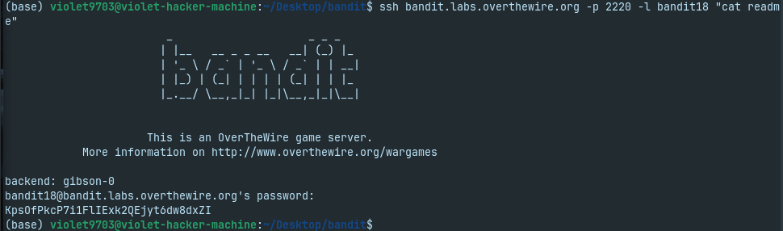

---

# Level 19

## Objective

Use the provided SUID binary to execute a command with elevated privileges and access the required file.

## Commands

Inspect the binary:

```bash
ls -l
```

Display the usage information:

```bash
./bandit20-do
```

Read the password file using the SUID binary:

```bash
./bandit20-do cat /etc/bandit_pass/bandit20
```

## Skills Practiced

- Identified a SUID executable.
- Learned how SUID binaries execute with the owner's privileges.
- Used a helper binary to perform an authorized privileged action.

## Screenshot

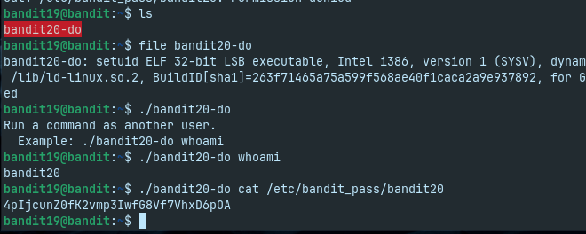

---

# Level 20

## Objective

Create a local listening service and use the provided SUID binary to communicate with it in order to retrieve the next credential.

## Commands

Start a listener on an available port:

```bash
nc -lvp 4444
```

In another terminal, execute:

```bash
./suconnect 4444
```

When prompted by the connection, submit the current credential.

## Skills Practiced

- Created a TCP listener using Netcat.
- Understood basic client-server communication.
- Worked with a SUID program that established a local network connection.
- Coordinated two terminal sessions to complete the interaction.

## Screenshots

### Netcat Listener

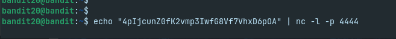

### Connecting with the SUID Binary

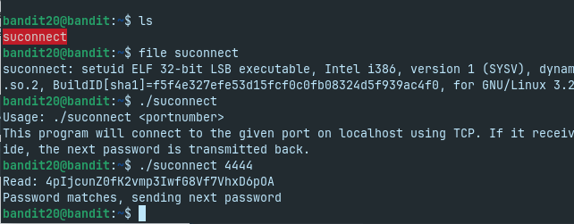

### Successful Communication

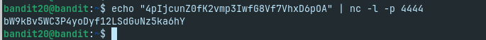
